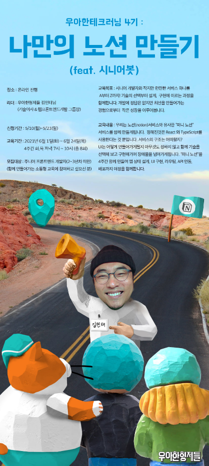
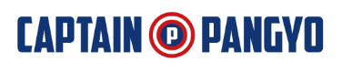
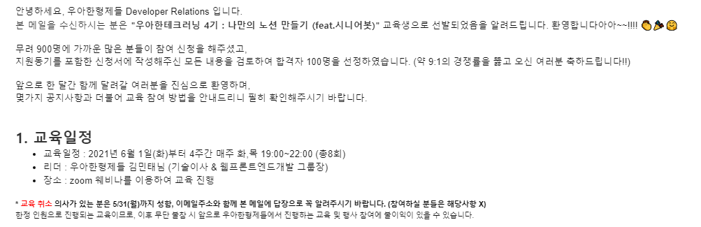

# 목차
### [1. 우아한테크러닝을 알게 된 계기👀](#우아한테크러닝을-알게-된-계기👀)
### [2. 지원동기✍️](#지원동기✍️)
### [3. 합격!!😁](#합격😁)
   
 

# 우아한테크러닝을 알게 된 계기👀
이번 우아한테크러닝은 React와 Typescript를 기반으로 미니 노션 만들기를 목표로 진행된다.

[우아한테크러닝 4기 모집](https://www.facebook.com/woowahanTech/posts/2870709896502930)
   
 

매주 개발자 컨퍼런스 및 해커톤 일정을 메일로 알려주는 서비스를 구독 중이었는데, 여기서 [우아한 테크캠프 4기](https://www.facebook.com/woowahanTech/posts/2870709896502930)를 모집한다는 걸 알고 바로 지원했다.
   
 
[개발자라면 구독해두자](https://github.com/brave-people/Dev-Event)   
   
 
   
# 지원동기✍️
현 Vue 아토믹 디자인으로 설계된 웹서비스를 개발하면서, **기존 프레임워크와 설계방식에 아쉬움**을 느꼈다.
반면 **React는 Vue와는 상반된 특징**을 가져 관심이 늘고 있었다.  
   

[프레임워크 고민에 도움을 준 게시글](https://joshua1988.github.io/web_dev/vue-or-react/)   
   
그래서 기존 프레임워크에 대한 고민과, 협업 문화를 배우고 싶다는 열쩡을 열심히 녹여내 지원동기를 썼다.   
한 달 특강 교육인데도 경쟁률이 높다.   
약 2-3문단 정도 적고 소제목도 야무지게 달았다.   
   
 

> 그 결과...   
   
# 합격!😁
   
>무려 경쟁률이 9:1 !! 뿌듯뿌듯

 

아직 자바스크립트도 서툰데, 타입스크립트라니!
이름만 보면 비슷할 것 같은데 '난 자바를 배웠으니까 자바스크립트도 금방 배우겠징?'하고 단단히 착각했던 과거가 있으므로...    
"[자바스크립트와 타입스크립트 차이점](https://velog.io/@pluviabc1/%EC%9E%90%EB%B0%94%EC%8A%A4%ED%81%AC%EB%A6%BD%ED%8A%B8%EC%99%80-%ED%83%80%EC%9E%85%EC%8A%A4%ED%81%AC%EB%A6%BD%ED%8A%B8-%EC%B0%A8%EC%9D%B4%EC%A0%90)" 게시글을 읽고 나니 역시 걱정할 시간에 일단 해보면 되겠다 싶다.